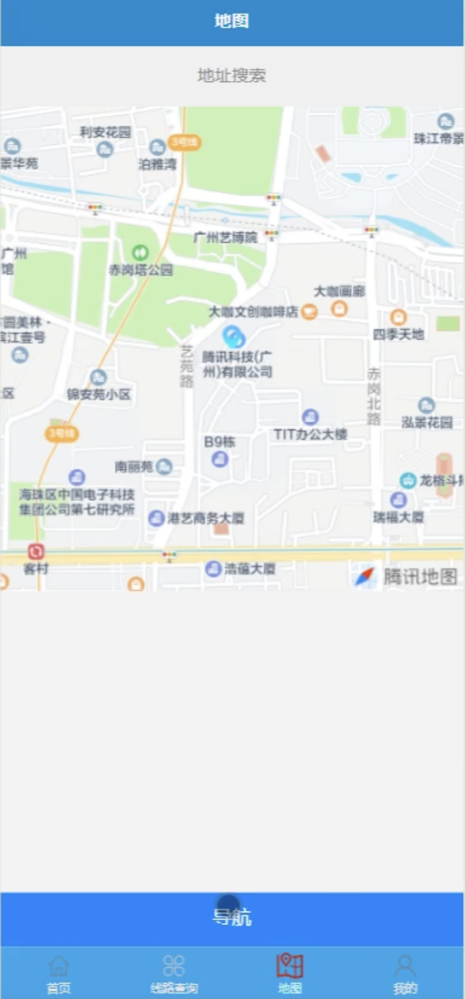
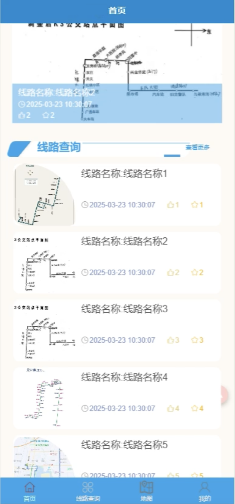
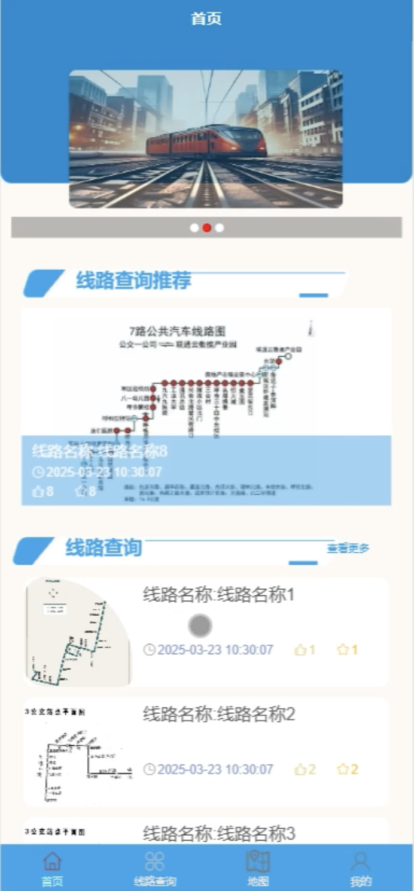
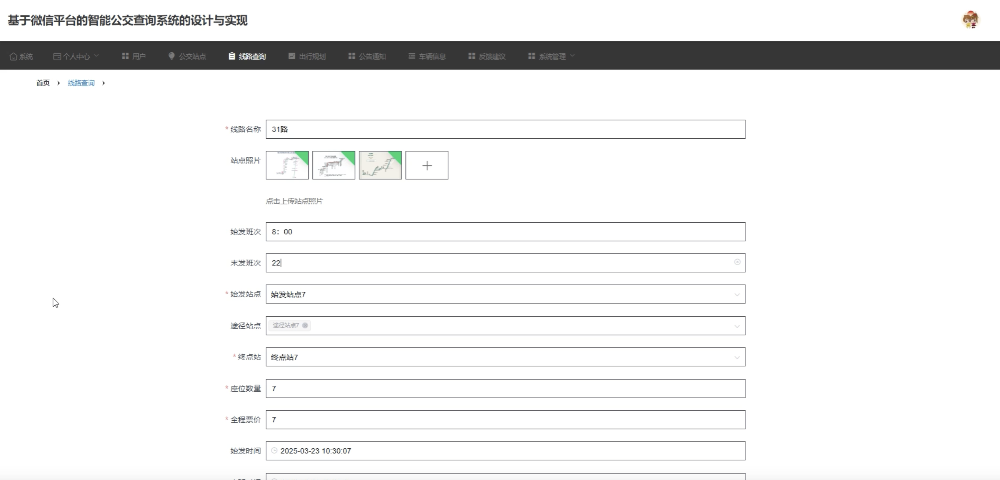
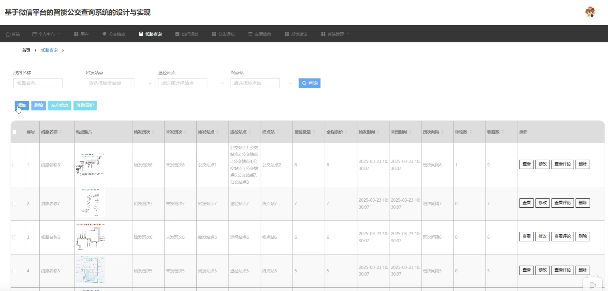

# mpweixinA235D
mpweixinA235D基于微信小程序的智能公交查询系统+LW
 
## 源码问题查看主页咨询

### 一、关键词
智能公交查询系统、公交查询小程序、公交线路查询系统、智能出行系统、公交信息查询平台

### 二、作品包含
源码+数据库+万字设计文档+全套环境和工具资源+本地部署教程

### 三、项目技术
前端技术：Html、Css、Js、Vue2.6、Element-ui、uniapp
后端技术：Java、SpringBoot2.2.2、MyBatis-Plus

### 四、运行环境（以下版本亲测，其他版本兼容性请自行测试）
开发工具：IDEA/eclipse + VSCODE + HBuilder X + 微信开发者工具

数据库：MySQL 5.7+

数据库管理工具：Navicat10以上版本

环境配置软件： JDK1.8 + Maven3.6+

前端Nodejs：14+

浏览器：谷歌浏览器

### 五、项目介绍
项目编号：mpweixinA235D

基于微信小程序的智能公交查询系统，为用户提供便捷的公交线路查询、站点信息查看、出行规划等功能，提升公共交通出行体验。

角色：管理员、用户

用户功能：注册登录、公交线路查询、站点信息查看、换乘查询、收藏线路、出行规划、个人中心。

管理员功能：登录、用户管理、公交线路管理、站点管理、线路站点管理、系统公告管理、反馈管理。

数据库表：13个

### 六、运行截图

